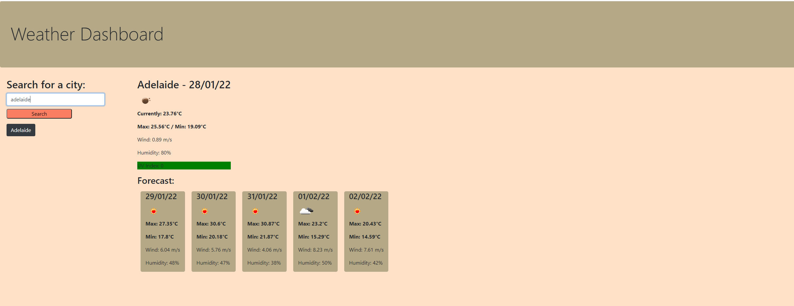
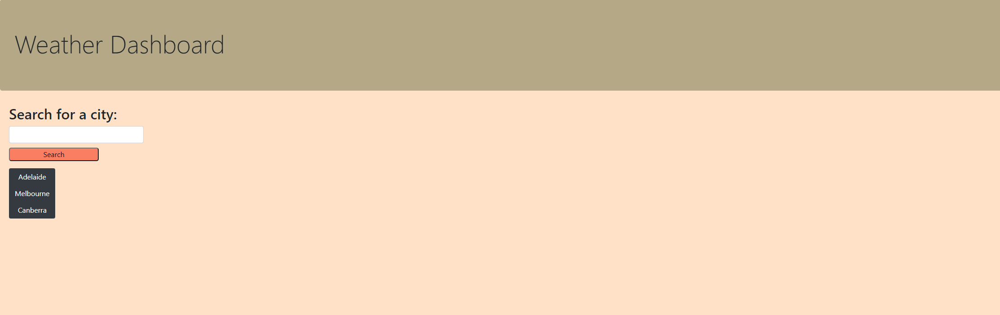

# Weather Dashboard

## Purpose

To display weather details for cities the user searches for.

## Details

User is able to search for a city and see current weather details, plus a five day weather forecast for that city. Cities they have searched for are saved in a search history so that they may click to easily view them again when returning to the page. Details that are displayed include the temperate (current, plus min and max for the day), humidity, UV index and wind speed.

## Built with

Bootstrap

Jquery

Moment.js

## Screenshots

## Link

https://hannahj25.github.io/weather-dashboard/

## Acknowledgements

Utilises OpenWeather's Current Weather and One Call APIs.
